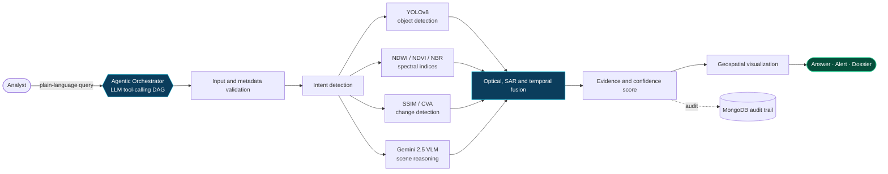
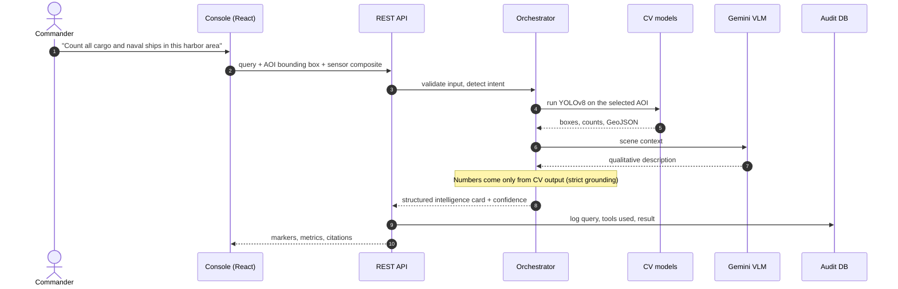
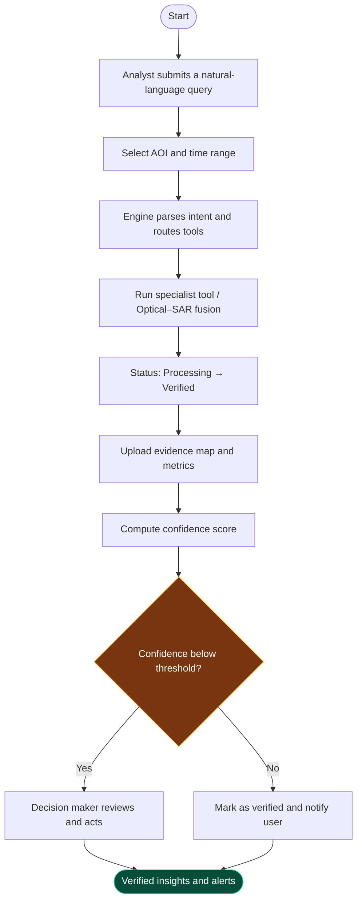

<div align="center">


<br/>


**An interactive vision-language assistant for multimodal remote-sensing analysis through plain-text queries.**

[Demo video](https://drive.google.com/file/d/1uGtNYGqfHxEvuASyZqh0dhKWTsbKI3WQ/view?usp=drive_link) · [How it works](#how-it-works) · [Screenshots](#console-screenshots) · [Feasibility](#feasibility)

</div>


<div align="center"></div>


## Overview

Satellite imagery holds the answers to questions about floods, forest loss and port activity, but getting those answers still means **data → GIS tools → a trained analyst**. That takes time that disaster response and security teams do not have.

SatQuery AI replaces that chain with a single step:

> **question → AI agent → specialist models → multi-sensor evidence → actionable answer**

Ask a question in plain language. An agentic orchestrator validates the input, picks the right models (object detection, change detection, spectral indices, a vision-language model), fuses optical, SAR and temporal evidence, and returns an answer where every number is traceable to a model output.


<div align="center"></div>


## See it in action

The loop below shows one full query: typed, routed through the tool pipeline, and answered with grounded detections on the map.

<div align="center">
  
</div>


<div align="center"></div>


## How it works

<div align="center">
  
</div>

<br/>

### Automatic model selection

Different questions light up different paths. A ship-counting query uses the detector and the VLM. A flood query switches to spectral indices, change detection and SAR.

<div align="center">
  
</div>

### Full flow



### Sequence of a single query




<div align="center"></div>


## Multi-sensor intelligence

### Optical + SAR fusion
When clouds block the optical pass, SAR fills the gap, so the answer never goes dark.

<div align="center">
  
</div>

### Change detection
Bi-temporal SSIM / CVA and NDWI thresholds turn two passes into a change map with a measured area.

<div align="center">
  
</div>

### Proactive alerts
AOIs are monitored continuously, and each alert opens the affected mission in one click.

<div align="center">
  
</div>

<div align="center"></div>

## Key features

| | |
|:---|:---|
| **Natural-language tasking** | Ask by text or voice, with no GIS workflow required |
| **Agentic orchestration** | A tool-calling DAG routes each query to the right specialist model |
| **Multi-sensor fusion** | Optical, SAR and multi-temporal data in one view, with SAR fallback when clouds block optical |
| **Strict number grounding** | Counts and areas come only from CV models, never from the language model |
| **Change detection** | Bi-temporal SSIM / CVA heatmaps plus NDWI and NDVI deltas |
| **Proactive alerts** | Monitored AOIs raise flood, deforestation and traffic alerts automatically |
| **Access control and audit** | Gateway login, clearance roles and a MongoDB audit trail |
| **Exportable dossiers** | PDF, GeoJSON and CSV metrics in one click |


<div align="center"></div>


## Console screenshots

Screenshots from the running prototype.

**Ground station gateway.** Operator authentication before the console opens.

<div align="center">
  
</div>

**Agentic query console.** A harbor query being routed over Mumbai Port & Naval Dockyard.

<div align="center">
  
</div>

**Full tactical HUD.** Monitored zones, AOI bounding box, sensor composites, map toggles and the intelligence panel.

<div align="center">
  
</div>

**Proactive monitor alerts.** The system watches AOIs and surfaces changes with a one-click inspect action.

<div align="center">
  
</div>

**Any mission, any query.** The same console handling a Western Ghats forest-fire query.

<div align="center">
  
</div>

**Built-in architecture and alerts view.**

<div align="center">
  
</div>

**Compact query panel.**

<div align="center">
  
</div>


<div align="center"></div>


## Sensor composites and monitored zones

| Composite | Purpose |
|:---|:---|
| RGB True | Natural-colour view of the AOI |
| NIR False | Vegetation and land/water contrast |
| NDWI Water | Water bodies and flood extent |
| NDVI Veg | Canopy health and deforestation |
| SAR Radar | All-weather, cloud-penetrating imaging |
| Thermal | Heat signatures |

| Zone | Primary sensor | Use case |
|:---|:---|:---|
| Mumbai Port & Naval Dockyard | Cartosat-3 (0.28 m) | Vessel counting, port infrastructure |
| Brahmaputra River Basin | Sentinel-1/2 SAR | Flood inundation |
| Western Ghats Biosphere | Sentinel-2 MSI | Deforestation and canopy loss |
| SDSC-SHAR Sriharikota | Cartosat-3 | Launch-site monitoring |

**Example queries**

```text
Count all cargo and naval ships in this harbor area
Identify large container vessels docked along the eastern berths
Detect any fuel storage tanks and coastal support infrastructure
forest fires in Western Ghats
```


<div align="center"></div>


## Feasibility

<div align="center">
  
</div>

### Risks and mitigation

| Risk | Severity | Mitigation |
|:---|:-:|:---|
| Cloud cover and data availability | High | Multi-sensor fallback: SAR when optical is clouded |
| Model accuracy (false positives, subtle changes) | High | Evidence-first grounding, confidence scoring, human verification flags |
| Optical–SAR cross-modal alignment | Medium | Phased validation approach |
| Limited validation data | Medium | Benchmark datasets, adapters planned |
| Geospatial uncertainty | Low | WGS84 / EPSG:4326 georeferencing checks |

An offline deterministic demo mode keeps the system demonstrable in any environment.


<div align="center"></div>


## User flow




<div align="center"></div>


## Impact

| Who benefits | How |
|:---|:---|
| Government and disaster agencies | Faster flood and land-use monitoring |
| Urban and infrastructure authorities | Urban expansion and infrastructure tracking |
| Agriculture and environment agencies | Vegetation and water-resource monitoring |
| Researchers and GIS professionals | Analysis through natural language |
| Decision makers | Evidence-based insights and faster decisions |

**National alignment:** UN SDG 9, 11, 13, 15. Indigenously built AI for sovereign geospatial intelligence, supporting India's climate and disaster-resilience goals.


<div align="center"></div>


## Tech stack

| Layer | Technologies |
|:---|:---|
| Frontend | React, TypeScript, Tailwind CSS, Vite, Leaflet (MapLibre planned) |
| Backend | Python REST API, agentic tool-calling DAG |
| AI / ML | Gemini 2.5 VLM, YOLOv8, SSIM / CVA, NDWI / NDVI / NBR, SAR–Optical fusion, GeoChat / RemoteCLIP (RS-VQA) |
| Geospatial | GeoJSON, COG raster pipeline, GeoTIFF / GDAL, WGS84 (EPSG:4326) |
| Data and audit | Optical, SAR and benchmark datasets, MongoDB audit trail |


<div align="center"></div>


## Getting started

```bash
git clone https://github.com/<your-username>/<your-repo>.git
cd <your-repo>

# frontend
npm install
npm run dev            # http://localhost:5173

# backend
pip install -r requirements.txt
python app.py
```

Keep API keys (for example the Gemini key) in a `.env` file and never commit it.


<div align="center"></div>


## References

| Paper | Used for |
|:---|:---|
| [VRSBench](https://arxiv.org/abs/2406.12384) | Single-image captioning, grounding and VQA baseline |
| [Change Detection Meets Visual Question Answering](https://arxiv.org/abs/2112.06343) | CDVQA task definition and fusion baseline |
| [Show Me What and Where has Changed?](https://arxiv.org/abs/2410.23828) | Pairing change answers with pixel-level masks |
| GeoChat: Grounded Large Vision-Language Model for Remote Sensing | Remote-sensing VLM reference |


<div align="center"></div>


<div align="center">

**Team ZeroOne** · Team ID 127589 · Atria Institute of Technology

<!-- Add team members:
| Name | Role | GitHub |
|---|---|---|
-->

</div>
